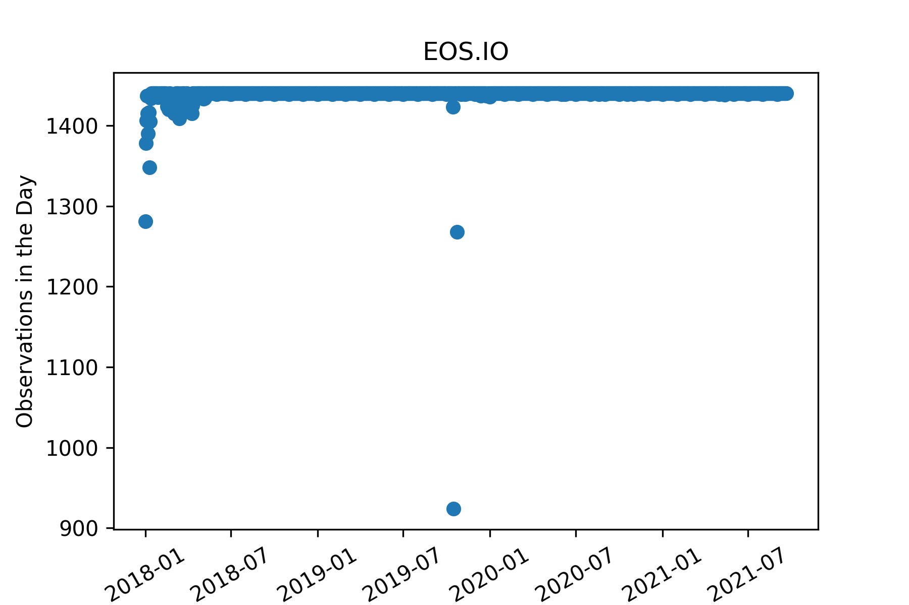
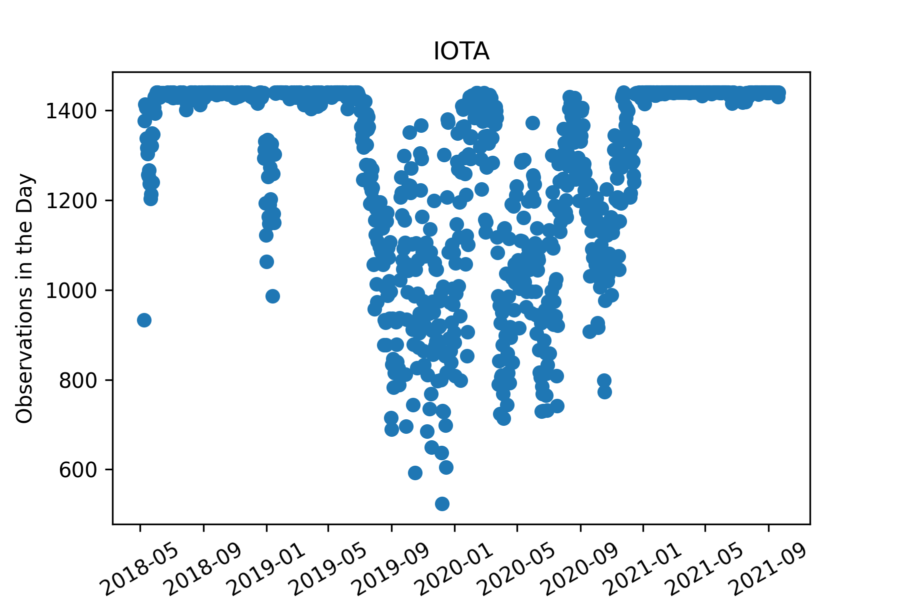

 
# Software stack:
Initially started working on a google collab ($50 monthly) for gpu access 
Once RAM became an issue turned to Saturn cloud computing, which became expensive 

# Competition Basics: 

Crypto forecasting competition for 14 different crypto currencies 
Train data: 1 Jan 2018 - 9 Sept 2021
Caveat, data given through training period at two different dumps, before final submission data was available to 24 Jan 2022
Forecasting period is from Feb 1st 2022 to May 3rd 2022
Scoring metric is weighted correlation with target value
Target value is log(t+1) / log(t+16) adjusted with a multiplier for overall market trend (of the 14 assets) and weighted value of the asset given
Asset weights range from 1.03 to 6.4
Understood this metric to be used over mse in order to reduce the influence of outliers of returns, but enhance the impact of identifying outliers amongst the market trend 
# Data Basics: 
Although every coin is described as going back to 1 Jan 2018, a good chunk of coins (sometimes referenced as shit coins) did not start or have clean data.
I.e. Dogecoin, monero, maker, tron, stellar, and EOS.io
Total rows: 24,236,806; total columns: 10
Each row represents a coin’s values at a given minute
The columns are: timestamp, asset_id, count, volume, vwap, open, high, low, close, target
If all the data is complete that means there would be 14 rows per minute (this is often not the case) 

# Data Deep dive:
Many contestants used a purged group time series split (https://www.kaggle.com/yamqwe/bottleneck-encoder-mlp-keras-tuner) 
This CV excels in time series data because it splits the data into equal groups based on how many days are available, then it provides a gap between the train data and the test data in order to prevent data leakage. 

Upon a close look at the data, many of the days across various coins do not have an equal amount of observations per period, thus this causes a major problem for this cross validation strategy to apply to our data: 

Coins like Maker, Monero, IOTA and doge would really struggle with this underlying cross validation strategy. Thus we wrote our own CV that did not split on days but instead collected the desired number of test windows, test window size, and gap, starting from the final data observations, and then used the remaining number of observations within the data to split into equal groups. This strategy seemed fair to us and we used a 3 fold validation, thus giving each fold around a year’s worth of data. A key reason this strategy seemed fair is because the identification of an individual day is not important to use in this category for training, for testing we tested on a 90 day window (5 days of data was used as an embargo to avoid any leakage, and then tested on the following 85 days for assessment)

# Feature Engineering:
 
## The basics: 
Time features augmented for cos and sin: Minute of day, month, total days into month (adjusted for month), day of week
Minute difference ((close/high) - (open/high)) & Max minute difference ((high/close) - (low / close))
After creation of the above features, log10 (Count, open, high, low, close, volume, VWAP, max min difference) in order to make the distribution more normal 
Replacing any infinites with nan’s 
Aggregation across current period: 
Groupby timestamp, mean, median, min, max, std across Count, Volume, Minute difference, mas min difference
For each row difference from market mean and median
Indicator column on if it the highest or smallest value for for the count, minute difference, or max min difference 
Lag features (60 minutes & 1 day (1440 minutes); rare cases different versions of lags) via bottleneck: 
Mean and standard deviation across an assets values, and market trend mean and standard deviation
Lag peak detection (https://stackoverflow.com/questions/22583391/peak-signal-detection-in-realtime-timeseries-data )
Z-score threshold of -3 and 3 
Comparison across lags 
# Modeling:
Through initial Tuning of NN’s and boosted models it appeared that boosted models would outperform NN’s 
Final settle was on 1 set of models for each coin, each set contained 3 seeds across the top 3 architectures from hyperparameter tuning
Ensemble just simple average

# Reflection:

# Things that didn’t work:
Neural nets 
Percentage of market (time component)

Things that ran out of time to implement:
Target recreation
Ensemble creativity
Adding extra lags 
Bottleneck rank 
Rolling correlation
Combining (shit) coins in order to give more data 
Model for market trend 
Model for weekdays vs weekend 
Weekday avg of NA’s: 104,607.2
Weekend avg of NA’s: 113,652.5

# Learning Lessons:
Datatable and Jay files 
Pydata
Bottleneck
Numpy speed 
