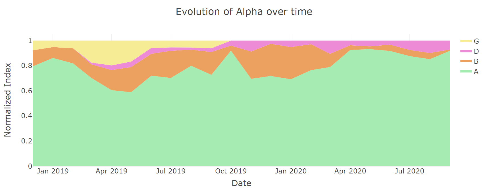
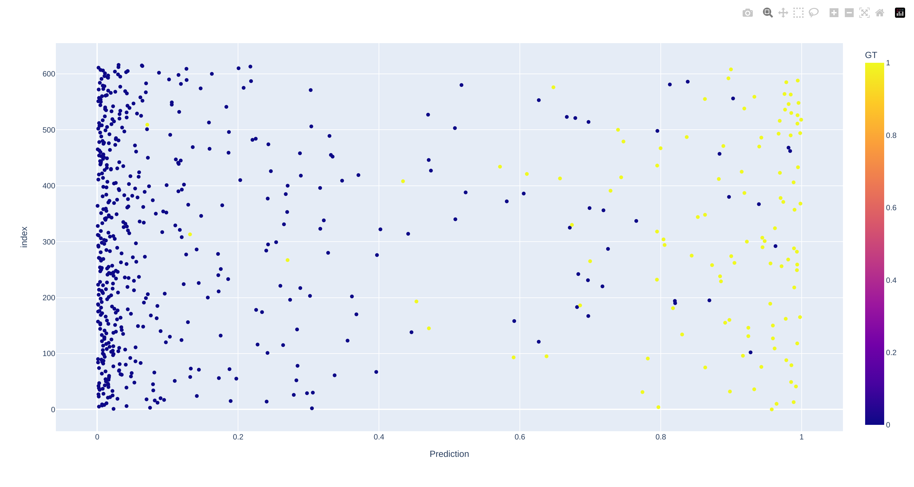

# icr_kaggle

# Links:
* [Competition](https://www.kaggle.com/competitions/icr-identify-age-related-conditions/overview)
* [Leaderboard](https://www.kaggle.com/competitions/icr-identify-age-related-conditions/leaderboard) finished 1583rd out of 6,430. Had an unselected submission that would have placed me 321st (Silver Medal Range). 

### EDA 
* There were a lot of good notes and skepticism about the data. ([raddar example](https://www.kaggle.com/code/raddar/icr-competition-analysis-and-findings))

### FE 
* There are many accounts of unique feature engineering techniques I detailed below in things that didn't work. In the end I attempted to involve interaction terms that were decided by GBDT models. This helped improve my local CV score but in the end didn't correlate to the private leaderboard.

### CV
* taking advantage of the data size, my cv consisted of running each model tested against three different splits of the data. One split was stratified on Class alone (the only value cared about in evaluation), a split on Alpha, and a split on Gamma. Alpha is a more granular split of Class dividing into 3 categories, and Gamma is a more granular version of Alpha dividing each Alpha into two further categories.
* When assessing models across these folds, typically Class and Alpha had well correlated score but Gamma would lag behind. Using the average and standard deviation across these scores where 
### Model Testing 
* I tried a lot of different models, my final CV was 2 TabPFN models, 2 XGBoost Models and 1 SVM. This ensmble ended with a local CV of 0.1517, a leaderboard of 0.14 and a private score of 0.47.
* In the end my second submission I was concerened with the overfitting of my XGBoost models, so I selected a model that had the least amount of influence from an XGBoost model that diversified the models. This included an ensmble of 5 models predictions passed to a balanced Logistic Regression: 1 TABPFN, 1 TABPFN data neutralized, 1 XGBoost, 1 SVM (RBF Kernel), and 1 Randomized Greedy Forrest. This model scored a local CV: 0.1468 and a public score of: 0.17 with a private score of: 0.495
* I tried a lot of different modeling styles including psuedo labeling (which did benefit my private and public test scores), including feature engineered features, and different ensmbling strategies (weighted average, and multi-layer stacking). 

## Things that worked 
* Turning the problem into a multiclassification problem.
* Feature Neutralization for model diversity.
* Inclusion of other model types to increase ensemble diversity. 

## Things that didn't work 
 * Making seprate models to predict Alpha or Gamma instead of predicting Class.
   * Alpha and Gamma are more descript versions of the actual target variable (Class), which provided a good suspucion that providing a model with more details would serve quite useful, however due to small data size this did not appear to be beneficial. See the attached graphic for distrubition of these individual variables over time.
   
* [adding variables to identify multiple column outliers within an observation](https://www.kaggle.com/code/sarthakmehra03/icr-analysis-and-modelling)
* [adding GMM FE variables](https://www.kaggle.com/code/iamleonie/handling-multimodal-distributions-fe-techniques)
* PCA accross corelated features. Couldn't find any results across XGB that would lead me to believe this was beneificial in the modeling process.
* Filling missing values with conditional averages. I.e. useing the categorical variable EJ to subset down to different groups and then fill in the missing values.
  * Intution is because the missing value columns across train dataset were roughly the same distribution. Also the data was not large enough for ideas like this to be impactful.
* Removing outlier points. I always had a difficult time with hard points that were not popularly discussed, 313 & 509. Removing these points improved scores in some models but not consistently acorss seeds or cross validation strategies so I couldn't be sure it would work. Credit to [Moth](https://www.kaggle.com/alejopaullier) [for this graphic idea](https://www.kaggle.com/competitions/icr-identify-age-related-conditions/discussion/420435) below that is adapted to my data.
   
* Removal of features pre-neutralization and then use the resulting data in the same way as standard neutralization
* Greedy feature removal
  * removing the best feature every time until getting to a lower amount (starting 55 features down to 30-42 features)
* [RGF](https://github.com/RGF-team/rgf/tree/master)
* Most SVM kernels (Poly degree=2 alomst helped, and RBF had instances of helping but is very close on the fringe to overfitting)
* Predicting Alpha values and then collapsing those down to Class predictions

